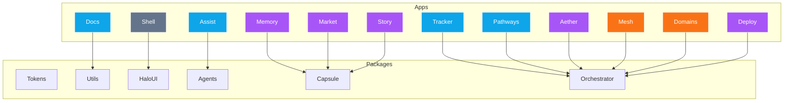

# 🌐 OurSynth V.I.B.E. — Unified Blueprint

Welcome to **vibe** — the Virtual Identity & Build Environment.  
This monorepo is the gold‑standard for modular, cinematic, and contributor‑friendly design systems.

---

## 🎯 Mission
vibe empowers contributors with clarity, reproducibility, and cinematic onboarding.  
It unifies design systems, agentic workflows, and provenance tracking into a single build environment.

---

## 🧩 Core Purpose
- **Design systems** — Glass/neon branding, accessibility‑first UI, token management  
- **Virtual identity** — Config‑driven onboarding, cinematic landing experiences, contributor delight  
- **Build environments** — Monorepo scaffolding, provenance tracking, agentic workflows, CI/CD guardrails  
- **Contributor tools** — First‑hour onboarding, prompt libraries, provenance logs, self‑healing workflows  

---

## ✨ Tagline
> vibe is the Virtual Identity & Build Environment — a modular, cinematic platform that empowers contributors, enforces clarity, and makes every interaction feel like part of a story.

---

## 🚀 Quick Start

```bash
# Clone and install
git clone <repo-url>
cd oursynth-vibe
pnpm install

# Start development
pnpm dev

# Explore onboarding
open apps/docs/first-hour.md
```

---

## 📂 Monorepo Structure

### `apps/` — Contributor-Facing Apps
- **Tracker** — Contributor activity & progress tracker  
- **Memory** — Intelligent memory capsules (contextual recall, timelines)  
- **Assist** — Embedded agent chat UI  
- **Pathways** — Guided onboarding flows  
- **Docs** — Contributor documentation (MDX)  
- **Shell** — Core layout & navigation  
- **Aether** — Automation workbench (recipes, visual debugging)  
- **Market** — Capsule & workflow marketplace  
- **Mesh** — Provenance graph viewer  
- **Story** — Timeline of events & provenance logs  
- **Domains** — Governance & compliance dashboard  
- **Deploy** — Deployment dashboard  

### `packages/` — Shared Infrastructure
- **core-tokens** — Colors, spacing, typography  
- **core-utils** — Utilities (fetcher, date formatting)  
- **halo-ui** — UI primitives (HaloButton, HaloCard)  
- **agents** — Agent interfaces & orchestration contracts  
- **capsule** — Capsule schema definitions  
- **orchestrator** — Event bus & workflow orchestrator  
- **storybook** — Component explorer & stories  
- **config** — Shared ESLint/TS configs  
- **testing** — Test setup & sample tests  

### `brand/`
- Logos, glass/neon assets, brand guidelines  

### `scripts/`
- Seed & migration scripts  

### `infra/`
- Terraform configs for apps & hosting  

---

## 📈 Architecture + Monetization Map



---

## 🧱 Monetization & Commercial Strategy

### Workflow & Monetization Strategies
- **Aether** → Premium automation workbench  
- **Memory** → Pro memory capsules & timelines  
- **Assist** → Embedded agent layer (free/basic, enterprise/provenance for paid tiers)  

### Monetization Angles
- **Free Tier** → Tracker, Docs, Assist (basic), Pathways  
- **Pro Tier** → Memory, Aether, Deploy, Story, Market  
- **Enterprise Tier** → Domains, Mesh, OCR, MCP integrations  

### Killer Features
- Real-time collaboration  
- AI-powered workflow scaffolding  
- Simulation & cost/time estimation  
- Visual provenance & Shell-integrated timeline  

---

## 📚 Glossary
- **Capsule** → Modular unit of knowledge/workflow
- **Agent** → Executable logic unit, orchestrated by event bus
- **Provenance** → Transparent record of actions/events
- **Shell** → Core layout & navigation environment
- **Memory** → Personal knowledge capsules & timelines

---

## 🤝 Contributing

1. **First Hour** → Explore `apps/docs/first-hour.md`
2. **Development Flow** → Tracker → Pathways → Shell → Story
3. **Architecture** → Review `packages/` for shared components

By positioning Aether as the visual command center, Memory as the knowledge layer, and Assist as the embedded agent interface, OurSynth vibe becomes a true, indispensable AI‑Driven Development Platform.