# OurSynth V.I.B.E. Unified Blueprint

_Last updated: September 25, 2025_  
_Status: Living, authoritative_

---

## 🌐 Platform Overview

**vibe** (Virtual Identity & Build Environment) is the gold-standard monorepo for modular, cinematic, and contributor-friendly design systems.  
Think of it as VS Code meets Figma: a shell environment where every module—Assist, Pathways, Mind, Tracker, Market, Mesh, Story, Domains, Deploy, Aether, Docs—lives side by side, powered by shared agents and provenance tracking.

---

## 🏁 Contributor Onboarding

- **Start at landing/**: Public entry, brand story, CTA, and authentication.
- **dashboard/**: Admin control panel, system health, analytics, user management.
- **shell/**: The environment loader and layout; modules mount here.
- **Modules**: Explore assist, pathways, mind, tracker, market, mesh, story, domains, deploy, aether, docs.
- **Docs**: Manifesto, naming conventions, prompt library, first-hour guide, diagrams, glossary.

---

## 🧭 Architecture & Navigation

- **Landing → Dashboard → Shell → Modules**: The canonical user journey.
- **Shell Layout**: Header (logo, nav), Sidebar (persistent links), Main Area (content/tasks), Footer (links/info).
- **Navigation Principles**: Persistent shell/sidebar, context-aware controls, deep-linking, modular integration.

---

## 🖥️ Modules & Agents

| Module      | Purpose/Features                                                                 | Agent(s)                |
|-------------|----------------------------------------------------------------------------------|-------------------------|
| landing     | Public entry, branding, CTA, authentication                                      |                         |
| dashboard   | Admin panel, analytics, user management                                          | AdminAgent              |
| shell       | Environment loader, layout, module registry                                      | ProvenanceAgent         |
| assist      | Conversational AI, prompt packs, code gen, refactor, commit hygiene              | AssistAgent             |
| pathways    | Wizard flows, onboarding, guided tasks                                           |                         |
| mind        | Notes, scratchpads, Capsule drafts                                               |                         |
| tracker     | Tasks, issues, sprints                                                           |                         |
| market      | Publishing, browsing, installing Capsules/modules                                |                         |
| mesh        | Simulation, visualization of modules/data flows                                  |                         |
| story       | Storybook UI explorer, component docs, accessibility                             |                         |
| domains     | Domain manager, registration, DNS, SSL checks                                    | DomainVerifierAgent     |
| deploy      | Deployment dashboard, build orchestration, logs, rollbacks                       | DeployAgent             |
| aether      | Visual workflow builder, drag-and-drop pipelines                                 |                         |
| docs        | Contributor handbook, diagrams, glossary, naming conventions                     |                         |

---

## 🗂️ Docs & Diagrams

- **Manifesto & Intro**: `apps/docs/intro.md`
- **Naming Conventions**: `apps/docs/naming.md`
- **Prompt Library**: `apps/docs/copilot-prompts.md`
- **First Hour Guide**: `apps/docs/first-hour.md`
- **Diagrams**: `apps/docs/diagrams/`
  - Capsule Lifecycle
  - Universal Compiler
  - Domains + Deploy Flow
  - Top-Level Navigation
  - End-to-End Lifecycle
  - Repo Map
  - Milestone Ladder
- **Glossary**: `apps/docs/glossary.md`

---

## 🛠️ Engineering Standards & Guardrails

- **Code Quality**: Strict TypeScript, modular design, Halo UI primitives.
- **Documentation**: Living docs, diagrams, onboarding guides.
- **Testing**: Unit/e2e tests, provenance assertions, CI/CD pipelines.
- **Provenance**: Log significant actions, expose timeline/diffs in Shell’s RightSidebar.
- **Accessibility**: All UI uses Halo UI, verified in Storybook/Playwright.
- **Shared Logic**: Lives in packages; apps import, never duplicate.

---

## 🗄️ Repo Map (Mermaid)

```mermaid
graph TD
  A[Root: vibe monorepo] --> B[apps/]
  A --> C[packages/]
  A --> D[brand/]
  A --> E[scripts/]
  A --> F[.github/workflows/]
  B --> B1[landing/]
  B --> B2[dashboard/]
  B --> B3[shell/]
  B --> B4[assist/]
  B --> B5[pathways/]
  B --> B6[mind/]
  B --> B7[tracker/]
  B --> B8[market/]
  B --> B9[mesh/]
  B --> B10[story/]
  B --> B11[domains/]
  B --> B12[deploy/]
  B --> B13[aether/]
  B --> B14[docs/]
  C --> C1[core-tokens/]
  C --> C2[core-utils/]
  C --> C3[halo-ui/]
  C --> C4[agents/]
  C --> C5[capsule/]
  C --> C6[orchestrator/]
  C --> C7[mesh/]
  C --> C8[storybook/]
  C --> C9[config/]
  C --> C10[testing/]
  D --> D1[assets/]
  E --> E1[seed.ts]
  E --> E2[migrate.ts]
  F --> F1[ci.yml]
  F --> F2[deploy-docs.yml]
```

---

## 🧭 Command Wheel Reference

- **Command Center**: Orchestrates agent actions, module routing, provenance logging.
- **Slash Commands**: `/verify-domain`, `/deploy`, `/scaffold`, `/refactor`, `/test`, `/diagram`
- **Agent Registry**: All agents registered in `packages/agents`, imported via typed interfaces.

---

## 🏆 Contributor Milestones

- **First Steps**: Authenticate, read manifesto, complete First Hour guide, explore prompt library, understand repo map.
- **First Contributions**: Open PR, write a test, log provenance, create/edit Capsule, use agent in module.
- **Advanced Milestones**: Publish Capsule, deploy via DeployAgent, add diagram, contribute to halo-ui/core-utils, add new agent.
- **Mastery**: Design new module, lead onboarding, refactor shared logic, write new guide, mentor contributors.

---

## 📛 Naming Conventions

- **Brand**: vibe (umbrella for platform)
- **Environment**: shell/ (where modules mount)
- **Modules**: Lowercase, hyphen-free folder names (assist, pathways, domains, deploy)
- **Shared Logic**: In packages, imported by apps
- **Agents**: Registered in packages/agents, imported via typed interfaces

---

## ✨ Gold Ideas

- **Living Docs**: All documentation is versioned, linked, and updated as the platform evolves.
- **Cinematic Onboarding**: Contributors experience a guided journey from landing to mastery.
- **Provenance Tracking**: Every significant action is logged, reviewable, and replayable.
- **Modular Design**: New modules plug into shell via defined entry points.
- **No Guessing**: Every folder, file, and concept is documented and diagrammed.

---

## 📚 Quick Links

| Guide                      | Purpose                                      |
|----------------------------|----------------------------------------------|
| Intro & Manifesto          | Philosophy and platform overview             |
| Naming Conventions         | Brand, shell, and module naming rules        |
| Contributor First Hour     | Step-by-step onboarding                      |
| Copilot Prompt Library     | Scaffolding, refactoring, testing, docs      |
| Diagrams                   | Visual flows, repo map, lifecycle, command wheel |
| Glossary                   | Definitions of modules, agents, workflows    |

---

**This blueprint is the single source of truth for OurSynth V.I.B.E. architecture, onboarding, and contributor experience. Update as the platform evolves.**

---
