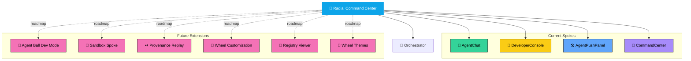

# Command Wheel Diagram

This diagram shows the invocation channels, spokes, and roadmap for the Command Wheel and its future extensions.

```mermaid
flowchart TD
  Wheel[🎡 Radial Command Center]:::wheel --> Orchestrator[🧠 Orchestrator]

  subgraph CurrentSpokes[Current Spokes]
    Chat[💬 AgentChat]:::chat
    Console[🧩 DeveloperConsole]:::console
    Push[🛠️ AgentPushPanel]:::push
    Center[🧠 CommandCenter]:::center
  end

  subgraph FutureSpokes[Future Extensions]
    BallDev[🔮 Agent Ball Dev Mode]:::future
    Sandbox[🧪 Sandbox Spoke]:::future
    Replay[⏪ Provenance Replay]:::future
    Custom[🎨 Wheel Customization]:::future
    Registry[📜 Registry Viewer]:::future
    Themes[🌈 Wheel Themes]:::future
  end

  Wheel --> Chat
  Wheel --> Console
  Wheel --> Push
  Wheel --> Center

  Wheel -. roadmap .-> BallDev
  Wheel -. roadmap .-> Sandbox
  Wheel -. roadmap .-> Replay
  Wheel -. roadmap .-> Custom
  Wheel -. roadmap .-> Registry
  Wheel -. roadmap .-> Themes

  classDef wheel fill:#0ea5e9,stroke:#fff,color:#fff
  classDef chat fill:#34d399,stroke:#000,color:#000
  classDef console fill:#facc15,stroke:#000,color:#000
  classDef push fill:#60a5fa,stroke:#000,color:#000
  classDef center fill:#a78bfa,stroke:#000,color:#000
  classDef future fill:#f472b6,stroke:#000,color:#000
```
