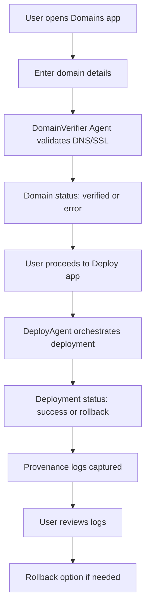

# Domains + Deploy Flow

This diagram shows the infrastructure pipeline for domain management and deployment, including agent orchestration.

```mermaid
graph TD
  A[User opens Domains app] --> B[Enter domain details]
  B --> C[DomainVerifier Agent validates DNS/SSL]
  C --> D[Domain status: verified or error]
  D --> E[User proceeds to Deploy app]
  E --> F[DeployAgent orchestrates deployment]
  F --> G[Deployment status: success or rollback]
  G --> H[Provenance logs captured]
  H --> I[User reviews logs]
  I --> J[Rollback option if needed]
```
