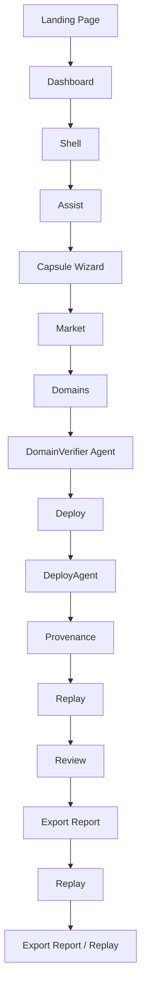

# End-to-End Lifecycle Flow

This diagram shows the full ecosystem journey, from public entry to provenance review and replay.

```mermaid
graph TD
  A[Landing Page] --> B[Dashboard]
  B --> C[Shell]
  C --> D[Assist]
  D --> E[Capsule Wizard]
  E --> F[Market]
  F --> G[Domains]
  G --> H[DomainVerifier Agent]
  H --> I[Deploy]
  I --> J[DeployAgent]
  J --> K[Provenance]
  K --> L[Replay]
  L --> M[Review]
  M --> N[Export Report]
  N --> O[Replay]
  O --> P[Export Report / Replay]
```
