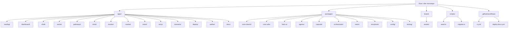

# Repo Map

This diagram shows the overall architecture of the OurSynth V.I.B.E. monorepo, including apps, packages, brand, scripts, and workflows.

```mermaid
graph TD
  A[Root: vibe monorepo] --> B[apps/]
  A --> C[packages/]
  A --> D[brand/]
  A --> E[scripts/]
  A --> F[.github/workflows/]
  B --> B1[landing/]
  B --> B2[dashboard/]
  B --> B3[shell/]
  B --> B4[assist/]
  B --> B5[pathways/]
  B --> B6[mind/]
  B --> B7[tracker/]
  B --> B8[market/]
  B --> B9[mesh/]
  B --> B10[story/]
  B --> B11[domains/]
  B --> B12[deploy/]
  B --> B13[aether/]
  B --> B14[docs/]
  C --> C1[core-tokens/]
  C --> C2[core-utils/]
  C --> C3[halo-ui/]
  C --> C4[agents/]
  C --> C5[capsule/]
  C --> C6[orchestrator/]
  C --> C7[mesh/]
  C --> C8[storybook/]
  C --> C9[config/]
  C --> C10[testing/]
  D --> D1[assets/]
  E --> E1[seed.ts]
  E --> E2[migrate.ts]
  F --> F1[ci.yml]
  F --> F2[deploy-docs.yml]
```
