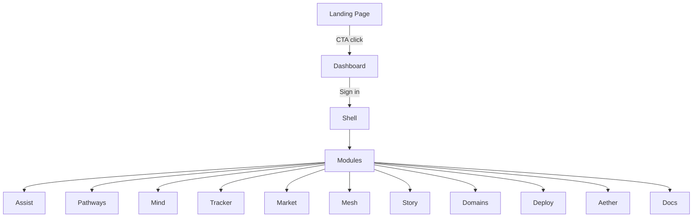

# Top-Level Navigation Flow

This diagram shows the user journey from the public landing page, through the dashboard, into the shell, and onward to all modules.

```mermaid
graph TD
  A[Landing Page] -->|CTA click| B[Dashboard]
  B -->|Sign in| C[Shell]
  C --> D[Modules]
  D --> D1[Assist]
  D --> D2[Pathways]
  D --> D3[Mind]
  D --> D4[Tracker]
  D --> D5[Market]
  D --> D6[Mesh]
  D --> D7[Story]
  D --> D8[Domains]
  D --> D9[Deploy]
  D --> D10[Aether]
  D --> D11[Docs]
```
