# Command Wheel Reference

_Status: Living, authoritative_
_Last updated: September 24, 2025_

**See Also:**

- [Shell Layout](./architecture/SHELL_LAYOUT.md)
- [Agents Architecture](./agents/AGENTS.md)
- [Glossary](./GLOSSARY.md)
- [Engineering Standards](./STANDARDS.md)

The Radial Command Center (a.k.a. Command Wheel) is the floating, cinematic UI hub for invoking agents, file actions, and navigation tools inside OurSynth V.I.B.E.

📂 File Structure

| File                  | Location            | Purpose                                                      |
|-----------------------|--------------------|--------------------------------------------------------------|
| RadialCommandCenter.tsx | apps/shell/        | Core React component for the wheel. Renders actions as radial buttons. |
| RadialCommandCenter.css | apps/shell/        | Styling for the wheel (glass, neon, radial layout).          |
| Wheel.tsx             | apps/shell/        | Wrapper that hydrates the wheel dynamically from actions.json + orchestrator registry.json. |
| actions.json          | apps/shell/        | Declarative list of available push‑button actions (id, label, run command). |
| registry.json         | packages/orchestrator/ | Registry of active agents and workflows. Used to filter which actions are currently available. |

DeveloperConsole.tsx (optional)

apps/shell/

Adapted from deprecated AgentPushPanel. Provides a raw “push to agent” console for advanced users.

AgentBallDemo.tsx

apps/shell/

Animated “Agent Ball” avatar. Can be paired with the wheel as a floating assistant or status indicator.

CommandCenter.tsx

apps/shell/

Unified interface combining AgentChat, AgentPushPanel, and action runner.

AgentChat.tsx

apps/shell/

Chat interface for interacting with AI agents.

AgentPushPanel.tsx

apps/shell/

Raw push panel for invoking agents with custom JSON payloads.

🌐 Invocation Channels Spectrum

The Command Center offers multiple ways to invoke agents:

- 🎡 Radial Command Center → cinematic, contributor‑facing wheel
- 💬 AgentChat → conversational, natural language entry point
- 🧠 CommandCenter → structured console combining chat, push, and action runner
- 🛠️ AgentPushPanel → raw JSON push for debugging and power users
- 🧩 DeveloperConsole → optional hidden spoke for advanced workflows

All channels route through the Orchestrator, ensuring provenance, consistency, and agent registry compliance.

🧭 Action Hierarchy

- Core Agent Actions: Chat (AssistAgent), Memory capsule, Aether recipe, Provenance timeline, Sentient Suggestions, Domains Manager
- File & Workspace Actions: Edit file, View history, Run tests, Deploy preview
- Navigation & Tools: Tracker, Docs, Settings, Market

⚙️ Dynamic Hydration

The wheel is hydrated at runtime:

```js
useEffect(() => {
  fetchRegistry().then(registry => {
    const filtered = actions.filter(a => registry.includes(a.id));
    setAvailableActions(filtered);
  });
}, []);
```

This ensures only available agents/actions appear.

🧩 Developer Console

Adapted from the old AgentPushPanel, this panel allows:

- Manual agent invocation (/api/agent/push)
- JSON param injection
- Inline result feedback

Useful for debugging, testing new agents, or power‑user workflows.

🧩 Developer Console in the Spectrum

The DeveloperConsole.tsx component is a modernized evolution of the old AgentPushPanel. It provides a hidden spoke in the Command Wheel for advanced contributors and developers.

Capabilities:

- Manual agent invocation via /api/agent/push
- JSON parameter injection for testing edge cases
- Inline result feedback for debugging
- Extensible for provenance logs or replay features

Role in the Spectrum:

- 🎡 Radial Command Center → cinematic, contributor‑facing
- 💬 AgentChat → conversational, natural language
- 🧠 CommandCenter → structured console
- 🛠️ AgentPushPanel → raw JSON push
- 🧩 DeveloperConsole → hidden power‑user spoke

By keeping the Developer Console available (even if tucked away), the system remains both accessible for everyday contributors and limitless for advanced builders.

🧠 Command Center

The CommandCenter.tsx component unifies:

- AgentChat → conversational interface with agents
- AgentPushPanel → raw push console
- Action runner → list of available actions and output viewer

This provides a single interface for contributors and developers to interact with agents.

🔮 Agent Ball Integration

The Agent Ball (AgentBallDemo.tsx) can be used alongside the wheel as:

- A floating avatar that glows when agents are active
- A status indicator (color = agent state, glow = activity)
- An interactive assistant (click to open chat or provenance)

This adds a cinematic, ambient presence to the wheel — making the system feel alive.

🔗 Invocation Channels Diagram

```mermaid
flowchart TD
  Wheel[🎡 Radial Command Center]:::wheel --> Orchestrator[🧠 Orchestrator]
  Chat[💬 AgentChat]:::chat --> Orchestrator
  Console[🧩 DeveloperConsole]:::console --> Orchestrator
  Push[🛠️ AgentPushPanel]:::push --> Orchestrator
  Center[🧠 CommandCenter]:::center --> Chat
  Center --> Push
  Center --> Console

  classDef wheel fill:#0ea5e9,stroke:#fff,color:#fff
  classDef chat fill:#34d399,stroke:#000,color:#000
  classDef console fill:#facc15,stroke:#000,color:#000
  classDef push fill:#60a5fa,stroke:#000,color:#000
  classDef center fill:#a78bfa,stroke:#000,color:#000
```



✨ Golden Thought

The Command Wheel should feel like a living interface:

- Context‑aware actions (only what’s relevant)
- Ambient presence (Agent Ball glow, Sentient suggestions)
- Dual modes: cinematic wheel for contributors, raw console for developers

Together, these make the wheel not just a menu, but the heartbeat of V.I.B.E..

🚀 Future Extensions

Ideas for evolving the Command Wheel and its spokes:

- Agent Ball Developer Mode
  - Glow color changes when Developer Console is active
  - Tooltip shows current agent state or debug info
- Sandbox Spoke
  - Add a new spoke for experimental agents and panels
  - Contributors can test ideas without affecting production
- Provenance Replay
  - Developer Console gains a “Replay” tab
  - Shows timeline of agent invocations with diff view
- Wheel Customization
  - Contributors can drag spokes to rearrange
  - Toggle visibility of spokes based on role
- Agent Registry Viewer
  - Visual interface for actions.json and registry.json
  - Shows which agents are active, deprecated, or experimental
- Command Wheel Themes
  - Neon, glass, retro, dark mode
  - Contributors can pick their vibe

These ideas keep the Command Wheel fresh, extensible, and contributor‑driven.

## 🗺️ Future Extensions Diagram

```mermaid
flowchart TD
  Wheel[🎡 Radial Command Center]:::wheel --> Orchestrator[🧠 Orchestrator]

  subgraph CurrentSpokes[Current Spokes]
    Chat[💬 AgentChat]:::chat
    Console[🧩 DeveloperConsole]:::console
    Push[🛠️ AgentPushPanel]:::push
    Center[🧠 CommandCenter]:::center
  end

  subgraph FutureSpokes[Future Extensions]
    BallDev[🔮 Agent Ball Dev Mode]:::future
    Sandbox[🧪 Sandbox Spoke]:::future
    Replay[⏪ Provenance Replay]:::future
    Custom[🎨 Wheel Customization]:::future
    Registry[📜 Registry Viewer]:::future
    Themes[🌈 Wheel Themes]:::future
  end

  Wheel --> Chat
  Wheel --> Console
  Wheel --> Push
  Wheel --> Center

  Wheel -. roadmap .-> BallDev
  Wheel -. roadmap .-> Sandbox
  Wheel -. roadmap .-> Replay
  Wheel -. roadmap .-> Custom
  Wheel -. roadmap .-> Registry
  Wheel -. roadmap .-> Themes

  classDef wheel fill:#0ea5e9,stroke:#fff,color:#fff
  classDef chat fill:#34d399,stroke:#000,color:#000
  classDef console fill:#facc15,stroke:#000,color:#000
  classDef push fill:#60a5fa,stroke:#000,color:#000
  classDef center fill:#a78bfa,stroke:#000,color:#000
  classDef future fill:#f472b6,stroke:#000,color:#000
```



---

## 🚀 Command Wheel Revamp (2025)

The Command Wheel is evolving to become the heartbeat of V.I.B.E., blending cinematic UI, agent orchestration, and contributor empowerment. Here’s what’s new and what’s next:

### ✨ New Features & Golden Ideas

- **Ambient Presence**: Agent Ball glows and animates based on agent activity, status, and provenance events.
- **Context-Aware Actions**: Only relevant actions and agents appear, filtered by registry and user role.
- **Dual Modes**: Cinematic wheel for contributors, raw console for developers and power users.
- **Provenance Replay**: Timeline and diff view for agent invocations, accessible from the wheel or Developer Console.
- **Customizable Spokes**: Contributors can rearrange, hide, or theme spokes based on their workflow.
- **Registry Viewer**: Visual interface for actions.json and registry.json, showing active, deprecated, and experimental agents.
- **Sandbox Spoke**: Dedicated spoke for experimental agents, panels, and workflows.
- **Wheel Themes**: Neon, glass, retro, dark mode, and more—pick your vibe.

### 🧭 Contributor Guidance

- **Start in the Wheel**: All agent actions, file tools, and navigation begin here.
- **Use the Console for Power Tasks**: Advanced contributors can invoke agents manually, inject JSON, and debug workflows.
- **Replay Provenance**: Review, replay, and audit agent actions for trust and learning.
- **Customize Your Experience**: Drag spokes, toggle visibility, and select themes to match your workflow.
- **Explore the Registry**: See which agents are available, deprecated, or experimental—contribute new ones via registry.json.

### 🗺️ Roadmap Highlights

- **Agent Ball Developer Mode**: Visual feedback and debug info for agent state.
- **Sandbox Spoke**: Safe space for testing new ideas without affecting production.
- **Provenance Replay Tab**: Full timeline and diff view for agent actions.
- **Registry Viewer**: Interactive explorer for agent/action registry.
- **Wheel Customization**: Drag-and-drop spokes, toggle visibility, and theme selection.

---

**The Command Wheel is not just a menu—it’s the living interface, the pulse of V.I.B.E., and the launchpad for every contributor’s journey.**
