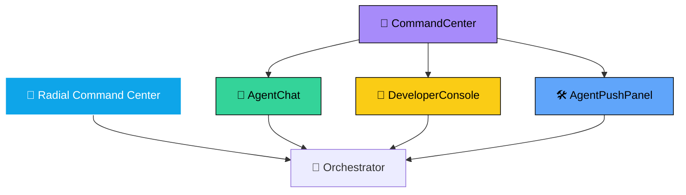

# Command Wheel Reference

_Status: Living, authoritative_
_Last updated: September 24, 2025_

**See Also:**

- [Shell Layout](./architecture/SHELL_LAYOUT.md)
- [Agents Architecture](./agents/AGENTS.md)
- [Glossary](./GLOSSARY.md)
- [Engineering Standards](./STANDARDS.md)

The Radial Command Center (a.k.a. Command Wheel) is the floating, cinematic UI hub for invoking agents, file actions, and navigation tools inside OurSynth V.I.B.E.

📂 File Structure

| File                  | Location            | Purpose                                                      |
|-----------------------|--------------------|--------------------------------------------------------------|
| RadialCommandCenter.tsx | apps/shell/        | Core React component for the wheel. Renders actions as radial buttons. |
| RadialCommandCenter.css | apps/shell/        | Styling for the wheel (glass, neon, radial layout).          |
| Wheel.tsx             | apps/shell/        | Wrapper that hydrates the wheel dynamically from actions.json + orchestrator registry.json. |
| actions.json          | apps/shell/        | Declarative list of available push‑button actions (id, label, run command). |
| registry.json         | packages/orchestrator/ | Registry of active agents and workflows. Used to filter which actions are currently available. |

DeveloperConsole.tsx (optional)

apps/shell/

Adapted from deprecated AgentPushPanel. Provides a raw “push to agent” console for advanced users.

AgentBallDemo.tsx

apps/shell/

Animated “Agent Ball” avatar. Can be paired with the wheel as a floating assistant or status indicator.

CommandCenter.tsx

apps/shell/

Unified interface combining AgentChat, AgentPushPanel, and action runner.

AgentChat.tsx

apps/shell/

Chat interface for interacting with AI agents.

AgentPushPanel.tsx

apps/shell/

Raw push panel for invoking agents with custom JSON payloads.

🌐 Invocation Channels Spectrum

The Command Center offers multiple ways to invoke agents:

- 🎡 Radial Command Center → cinematic, contributor‑facing wheel
- 💬 AgentChat → conversational, natural language entry point
- 🧠 CommandCenter → structured console combining chat, push, and action runner
- 🛠️ AgentPushPanel → raw JSON push for debugging and power users
- 🧩 DeveloperConsole → optional hidden spoke for advanced workflows

All channels route through the Orchestrator, ensuring provenance, consistency, and agent registry compliance.

🧭 Action Hierarchy

- Core Agent Actions: Chat (AssistAgent), Memory capsule, Aether recipe, Provenance timeline, Sentient Suggestions, Domains Manager
- File & Workspace Actions: Edit file, View history, Run tests, Deploy preview
- Navigation & Tools: Tracker, Docs, Settings, Market

⚙️ Dynamic Hydration

The wheel is hydrated at runtime:

```js
useEffect(() => {
  fetchRegistry().then(registry => {
    const filtered = actions.filter(a => registry.includes(a.id));
    setAvailableActions(filtered);
  });
}, []);
```

This ensures only available agents/actions appear.

🧩 Developer Console

Adapted from the old AgentPushPanel, this panel allows:

- Manual agent invocation (/api/agent/push)
- JSON param injection
- Inline result feedback

Useful for debugging, testing new agents, or power‑user workflows.

🧩 Developer Console in the Spectrum

The DeveloperConsole.tsx component is a modernized evolution of the old AgentPushPanel. It provides a hidden spoke in the Command Wheel for advanced contributors and developers.

Capabilities:

- Manual agent invocation via /api/agent/push
- JSON parameter injection for testing edge cases
- Inline result feedback for debugging
- Extensible for provenance logs or replay features

Role in the Spectrum:

- 🎡 Radial Command Center → cinematic, contributor‑facing
- 💬 AgentChat → conversational, natural language
- 🧠 CommandCenter → structured console
- 🛠️ AgentPushPanel → raw JSON push
- 🧩 DeveloperConsole → hidden power‑user spoke

By keeping the Developer Console available (even if tucked away), the system remains both accessible for everyday contributors and limitless for advanced builders.

🧠 Command Center

The CommandCenter.tsx component unifies:

- AgentChat → conversational interface with agents
- AgentPushPanel → raw push console
- Action runner → list of available actions and output viewer

This provides a single interface for contributors and developers to interact with agents.

🔮 Agent Ball Integration

The Agent Ball (AgentBallDemo.tsx) can be used alongside the wheel as:

- A floating avatar that glows when agents are active
- A status indicator (color = agent state, glow = activity)
- An interactive assistant (click to open chat or provenance)

This adds a cinematic, ambient presence to the wheel — making the system feel alive.

🔗 Invocation Channels Diagram



✨ Golden Thought

The Command Wheel should feel like a living interface:

- Context‑aware actions (only what’s relevant)
- Ambient presence (Agent Ball glow, Sentient suggestions)
- Dual modes: cinematic wheel for contributors, raw console for developers

Together, these make the wheel not just a menu, but the heartbeat of V.I.B.E..

🚀 Future Extensions

Ideas for evolving the Command Wheel and its spokes:

- Agent Ball Developer Mode
  - Glow color changes when Developer Console is active
  - Tooltip shows current agent state or debug info
- Sandbox Spoke
  - Add a new spoke for experimental agents and panels
  - Contributors can test ideas without affecting production
- Provenance Replay
  - Developer Console gains a “Replay” tab
  - Shows timeline of agent invocations with diff view
- Wheel Customization
  - Contributors can drag spokes to rearrange
  - Toggle visibility of spokes based on role
- Agent Registry Viewer
  - Visual interface for actions.json and registry.json
  - Shows which agents are active, deprecated, or experimental
- Command Wheel Themes
  - Neon, glass, retro, dark mode
  - Contributors can pick their vibe

These ideas keep the Command Wheel fresh, extensible, and contributor‑driven.

## 🗺️ Future Extensions Diagram

```mermaid
flowchart TD
  Wheel[🎡 Radial Command Center]:::wheel --> Orchestrator[🧠 Orchestrator]

  subgraph CurrentSpokes[Current Spokes]
    Chat[💬 AgentChat]:::chat
    Console[🧩 DeveloperConsole]:::console
    Push[🛠️ AgentPushPanel]:::push
    Center[🧠 CommandCenter]:::center
  end

  subgraph FutureSpokes[Future Extensions]
    BallDev[🔮 Agent Ball Dev Mode]:::future
    Sandbox[🧪 Sandbox Spoke]:::future
    Replay[⏪ Provenance Replay]:::future
    Custom[🎨 Wheel Customization]:::future
    Registry[📜 Registry Viewer]:::future
    Themes[🌈 Wheel Themes]:::future
  end

  Wheel --> Chat
  Wheel --> Console
  Wheel --> Push
  Wheel --> Center

  Wheel -. roadmap .-> BallDev
  Wheel -. roadmap .-> Sandbox
  Wheel -. roadmap .-> Replay
  Wheel -. roadmap .-> Custom
  Wheel -. roadmap .-> Registry
  Wheel -. roadmap .-> Themes

  classDef wheel fill:#0ea5e9,stroke:#fff,color:#fff
  classDef chat fill:#34d399,stroke:#000,color:#000
  classDef console fill:#facc15,stroke:#000,color:#000
  classDef push fill:#60a5fa,stroke:#000,color:#000
  classDef center fill:#a78bfa,stroke:#000,color:#000
  classDef future fill:#f472b6,stroke:#000,color:#000
  